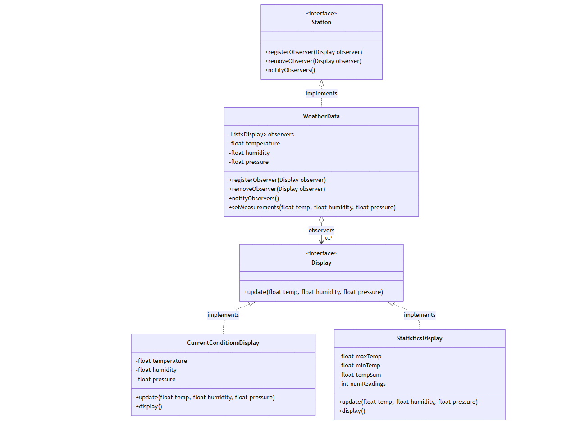

# 날씨 스테이션 - 옵저버 패턴 예제

이 프로젝트는 옵저버 패턴을 실제로 적용한 날씨 스테이션 구현 예제입니다. 기상 관측소의 데이터를 여러 디스플레이에 실시간으로 표시하는 시스템을 통해 옵저버 패턴의 실제 활용을 보여줍니다.

## 옵저버 패턴이란?

옵저버 패턴은 객체 간의 일대다(one-to-many) 의존 관계를 정의하여, 한 객체의 상태가 변경되면 그에 의존하는 모든 객체들이 자동으로 통지받고 갱신되는 방식을 정의한 디자인 패턴입니다.

### 주요 구성 요소

- **Subject (주제)**: 관찰 대상이 되는 객체
  - 옵저버들을 등록/제거하는 메서드 제공
  - 상태 변경 시 모든 옵저버에게 통지
- **Observer (관찰자)**: Subject의 변경을 감지하는 객체
  - Subject로부터 상태 변경을 통지받음
  - 변경된 상태에 따라 자신의 상태를 갱신

## 프로젝트 구조

```text
app/
├── src/
│ ├── main/java/observer/
│ │ ├── WeatherData.java # Subject 구현
│ │ ├── Display.java # Observer 인터페이스
│ │ ├── CurrentConditionsDisplay.java
│ │ └── StatisticsDisplay.java
│ └── test/java/observer/
│ ├── WeatherDataTest.java
│ ├── CurrentConditionsDisplayTest.java
│ └── StatisticsDisplayTest.java
```



## 구현 특징

1. **WeatherData (Subject)**
   - 온도, 습도, 기압 데이터 관리
   - 옵저버 목록 관리 및 상태 변경 시 통지

2. **디스플레이 구현체들 (Observer)**
   - CurrentConditionsDisplay: 현재 날씨 상태 표시
   - StatisticsDisplay: 날씨 통계 정보 표시

## 실행 방법

```bash
./gradlew run
```

## 테스트 실행

```bash
./gradlew test
```

## 옵저버 패턴의 장점

1. **느슨한 결합(Loose Coupling)**
   - Subject와 Observer는 서로의 구체적인 구현을 알 필요가 없음
   - 새로운 Observer 추가가 Subject의 수정 없이 가능

2. **유연한 객체 통신**
   - 런타임에 관계를 맺고 끊을 수 있음
   - 상태 변경 통지를 자동화할 수 있음

3. **변경의 유연성**
   - 새로운 디스플레이 타입을 추가하기 쉬움
   - 기존 코드 수정 없이 확장 가능

## 사용된 기술

- Java
- JUnit 5
- Mockito
- Gradle
